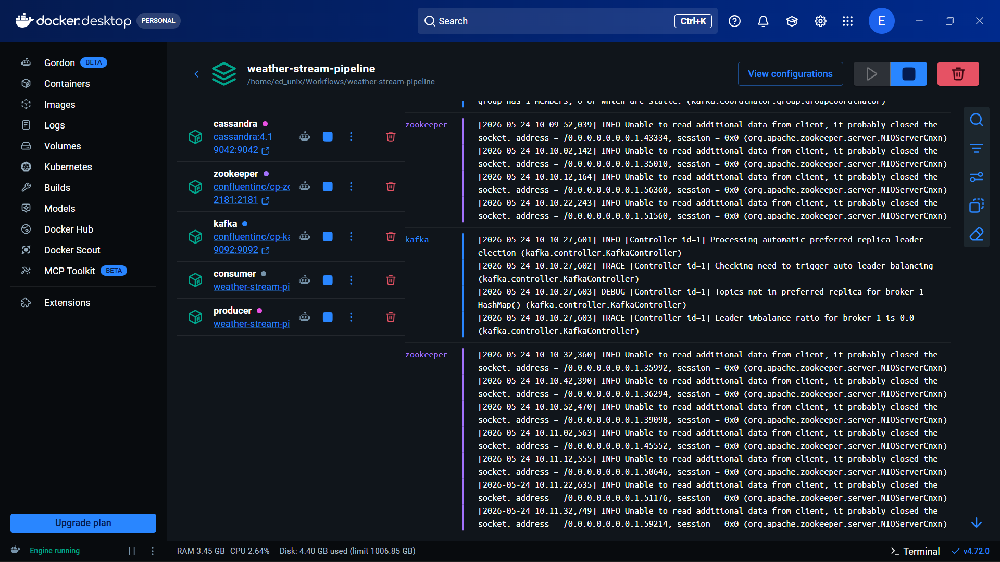
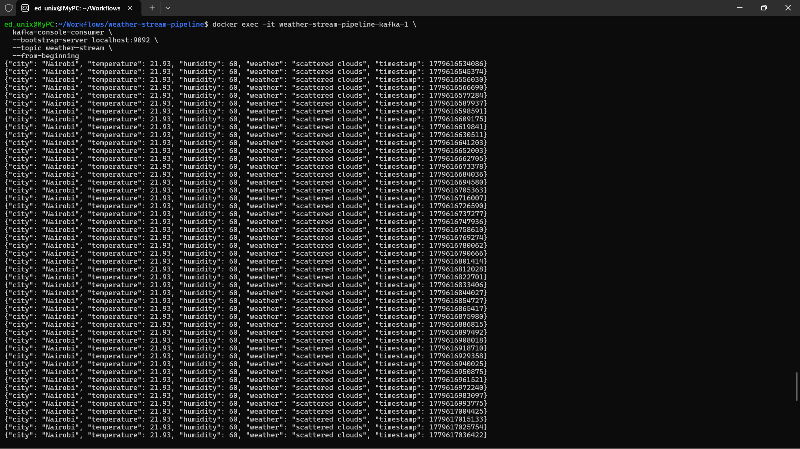

# Weather Streaming Pipeline with Apache Kafka & Cassandra

A real-time weather data streaming pipeline that fetches live weather data from the OpenWeatherMap API, streams it through Apache Kafka, and persists it to Apache Cassandra — all containerised with Docker Compose.

---

## Table of Contents

- [Overview](#overview)
- [Architecture](#architecture)
- [Project Structure](#project-structure)
- [Prerequisites](#prerequisites)
- [Configuration](#configuration)
- [Running the Pipeline](#running-the-pipeline)
- [Verifying the Pipeline](#verifying-the-pipeline)
- [Key Code & Architecture Decisions](#key-code--architecture-decisions)
- [Visuals](#visuals)
- [Troubleshooting](#troubleshooting)
- [Why use Kafka and Cassandra](#why-use-kafka-and-cassandra)
- [Quick Reference Cheat Sheet](#quick-reference-cheat-sheet)

---

## Overview

| Property       | Value                                         |
| -------------- | --------------------------------------------- |
| Data Source    | OpenWeatherMap REST API (`/data/2.5/weather`) |
| City Tracked   | Nairobi (configurable)                        |
| Poll Interval  | Every 10 seconds                              |
| Message Broker | Apache Kafka 7.4.0 (Confluent)                |
| Storage        | Apache Cassandra 4.1                          |
| Orchestration  | Docker Compose 3.8                            |
| Language       | Python 3.11                                   |

**Data flow:**

```
OpenWeatherMap API → Producer → Kafka Topic (weather-stream) → Consumer → Cassandra
```

Each message contains:

```json
{
  "city": "Nairobi",
  "temperature": 22.3,
  "humidity": 71,
  "weather": "broken clouds",
  "timestamp": 1748012345678
}
```

---

## Architecture

```
┌─────────────────────────────────────────────────────────────┐
│                      Docker Network                         │
│                                                             │
│  ┌─────────────┐     ┌───────────────────────────────────┐  │
│  │  Zookeeper  │◄────│            Kafka Broker           │  │
│  │  Port 2181  │     │            Port 9092              │  │
│  └─────────────┘     └──────────────┬────────────────────┘  │
│                                     │                       │
│  ┌──────────────────┐               │                       │
│  │    Producer      │               │  topic: weather-stream│
│  │  (Python 3.11)   │──────────────►│                       │
│  │                  │               │                       │
│  │  - Fetches from  │               │                       │
│  │    OpenWeather   │       ┌───────▼──────────┐            │
│  │    every 10s     │       │    Consumer      │            │
│  │  - Retries x15   │       │  (Python 3.11)   │            │
│  └──────────────────┘       │                  │            │
│                             │  - Reads from    │            │
│  ┌──────────────────┐       │    Kafka         │            │
│  │   Cassandra      │◄──────│  - Writes to     │            │
│  │   Port 9042      │       │    Cassandra     │            │
│  └──────────────────┘       └──────────────────┘            │
└─────────────────────────────────────────────────────────────┘
```

### Startup Order (enforced via health checks)

```
Zookeeper (healthy) → Kafka (healthy) → Producer + Consumer
                                      → Cassandra (healthy) → Consumer
```

---

## Project Structure

```
weather-stream-pipeline/
│
├── docker-compose.yml          # Orchestrates all services
├── .env.example                # API key
├── weather-stream-pipeline.md  # Project notes
│
├── producer/
│   ├── producer.py             # Fetches weather + publishes to Kafka
│   ├── Dockerfile
│   └── requirements.txt
│
├── consumer/
│   ├── consumer.py             # Reads from Kafka + writes to Cassandra
│   ├── Dockerfile
│   └── requirements.txt
│
├── images/
│   ├── consumer_stream.png
│   └── containers.png
│
└── cassandra/
    └── init.cql                # Keyspace + table schema
```

---

## Prerequisites

| Requirement            | Minimum Version                    |
| ---------------------- | ---------------------------------- |
| Docker Desktop         | 4.x                                |
| Docker Compose         | 3.8 (included with Docker Desktop) |
| OpenWeatherMap API Key | Free tier sufficient               |

Get a free API key at [openweathermap.org/api](https://openweathermap.org/api).

---

## Configuration

Create a `.env` file in the project root:

```bash
OPENWEATHER_API_KEY=your_api_key_here
```

> **Never commit `.env` to version control.** Add it to `.gitignore`:
>
> ```
> .env
> ```

To track a different city, update `CITY` in `producer/producer.py`:

```python
CITY = "Nairobi"  # Change to any city supported by OpenWeatherMap
```

---

## Running the Pipeline

### CLI

```bash
# 1. Navigate to the project root
cd weather-stream-pipeline

# 2. Build images and start all services
docker compose up --build

# 3. Run in detached (background) mode
docker compose up --build -d
```

### Docker Desktop

1. Open Docker Desktop
2. Go to **Containers**
3. Find `weather-stream-pipeline` and click **Play ▶**

> **First start takes ~60–90 seconds** while Zookeeper, Kafka, and Cassandra initialise. The producer will not connect until all health checks pass — this is intentional.

### Stopping the Pipeline

```bash
# Stop containers, preserve data volumes
docker compose down

# Stop containers AND wipe all data (Kafka topics, Cassandra records)
docker compose down -v
```

---

## Verifying the Pipeline

### 1. Check all services are healthy

```bash
docker compose ps
```

Expected output:

```
NAME                                    STATUS
weather-stream-pipeline-zookeeper-1     healthy
weather-stream-pipeline-kafka-1         healthy
weather-stream-pipeline-cassandra-1     running
weather-stream-pipeline-producer-1      running
weather-stream-pipeline-consumer-1      running
```

In **Docker Desktop**: each service shows a green dot; Kafka and Zookeeper show a heart icon once healthy.

---

### 2. Watch the producer sending data

```bash
docker compose logs -f producer
```

Expected output (every 10 seconds):

```
[Producer] Connecting to Kafka (attempt 1/15)...
[Producer] Connected to Kafka successfully.
[Producer] Sent: {'city': 'Nairobi', 'temperature': 22.3, 'humidity': 71, 'weather': 'broken clouds', 'timestamp': 1748012345678}
[Producer] Sent: {'city': 'Nairobi', 'temperature': 22.4, ...}
```

---

### 3. Watch the consumer receiving data

```bash
docker compose logs -f consumer
```

---

### 4. Watch producer and consumer together

```bash
docker compose logs -f producer consumer
```

---

### 5. Read messages directly from the Kafka topic

```bash
docker exec -it weather-stream-pipeline-kafka-1 \
  kafka-console-consumer \
  --bootstrap-server localhost:9092 \
  --topic weather-stream \
  --from-beginning
```

You should see JSON messages streaming every 10 seconds. Press `Ctrl+C` to exit.

**Docker Desktop:** Containers → `kafka-1` → **Exec** tab → paste the command above.

---

### 6. Inspect the Kafka topic

```bash
# List all topics
docker exec -it weather-stream-pipeline-kafka-1 \
  kafka-topics --bootstrap-server localhost:9092 --list

# Describe the weather-stream topic (partitions, replication factor, etc.)
docker exec -it weather-stream-pipeline-kafka-1 \
  kafka-topics --bootstrap-server localhost:9092 \
  --describe --topic weather-stream
```

---

### 7. Query data in Cassandra

```bash
docker exec -it cassandra cqlsh
```

Inside the `cqlsh` shell:

```sql
-- List all keyspaces
DESCRIBE keyspaces;

-- Switch to your keyspace
USE your_keyspace;

-- List tables
DESCRIBE tables;

-- Query the latest 10 weather records
SELECT * FROM weather LIMIT 10;
```

**Docker Desktop:** Containers → `cassandra` → **Exec** tab → type `cqlsh`.

---

## Key Code & Architecture Decisions

### 1. Health-check-gated startup order

A critical issue in multi-container pipelines is services starting before their dependencies are actually ready. Docker's `depends_on` alone only waits for a container to _start_, not to be _ready_.

This project solves it with proper health checks on every infrastructure service:

```yaml
# Zookeeper must be accepting connections before Kafka starts
zookeeper:
  healthcheck:
    test: ["CMD", "nc", "-z", "localhost", "2181"]

# Kafka runs a two-step check: broker API + topic list
# This ensures Kafka's internal topic setup is fully complete
kafka:
  healthcheck:
    test:
      [
        "CMD-SHELL",
        "kafka-broker-api-versions --bootstrap-server localhost:9092 && kafka-topics --bootstrap-server localhost:9092 --list",
      ]
    start_period: 45s # Kafka needs time before the first check

# Cassandra checked via cqlsh, not just a port ping
cassandra:
  healthcheck:
    test: ["CMD", "cqlsh", "-e", "describe keyspaces"]
    start_period: 60s # Cassandra is the slowest to initialise
```

The producer and consumer then use `condition: service_healthy` so they only start when infrastructure is genuinely ready.

---

### 2. Producer retry logic

The original producer crashed immediately on `NoBrokersAvailable` and relied on `restart: always` to loop — creating a noisy crash loop in logs. The fix adds a structured retry inside the app itself:

```python
def create_producer():
    for attempt in range(1, MAX_RETRIES + 1):   # 15 attempts, 5s apart = 75s window
        try:
            p = KafkaProducer(
                bootstrap_servers='kafka:9092',
                request_timeout_ms=30000,
                api_version_auto_timeout_ms=30000,
            )
            return p
        except NoBrokersAvailable:
            time.sleep(RETRY_DELAY)
    raise RuntimeError("Could not connect to Kafka after maximum retries.")
```

This gives a 75-second window (15 × 5s) for Kafka to become available before the producer gives up with a clean error.

---

### 3. `producer.flush()` after every send

`KafkaProducer.send()` is asynchronous — it batches messages in a buffer. Without `flush()`, messages can be lost if the container restarts before the buffer drains:

```python
producer.send(TOPIC, weather_data)
producer.flush()   # Block until the message is actually delivered
```

---

### 4. `restart: on-failure` instead of `restart: always`

`restart: always` restarts a container even on clean exits and masks persistent failures. `restart: on-failure` only restarts on non-zero exit codes, so intentional stops are respected and repeated crashes become visible.

---

### 5. Kafka advertised listener uses service name, not localhost

Inside Docker's network, containers address each other by service name. Using `localhost` for `KAFKA_ADVERTISED_LISTENERS` would make Kafka advertise an address unreachable by other containers:

```yaml
# Wrong — producer container can't reach 'localhost' as Kafka
KAFKA_ADVERTISED_LISTENERS: PLAINTEXT://localhost:9092

# Correct — resolves to the kafka container inside Docker's network
KAFKA_ADVERTISED_LISTENERS: PLAINTEXT://kafka:9092
```

The same applies in `producer.py`:

```python
bootstrap_servers='kafka:9092'   # Docker service name, not localhost
```

---

### 6. API calls are fault-tolerant

Weather fetches include a timeout and `raise_for_status()` so transient API errors (rate limits, network blips) are caught and logged rather than crashing the producer:

```python
def fetch_weather():
    try:
        response = requests.get(URL, timeout=10)
        response.raise_for_status()
        ...
    except Exception as e:
        print(f"[Producer] Failed to fetch weather data: {e}")
        return None   # Loop continues; next fetch attempted in 10s
```

---

## Visuals

### Desktop container view



### Consumer data stream



---

## Troubleshooting

### `NoBrokersAvailable` in producer logs

**Cause:** Producer started before Kafka broker was ready.

**Fix:** This is handled automatically by the health-check-gated `depends_on` and the retry loop in `producer.py`. If it persists beyond 75 seconds, check Kafka's own logs:

```bash
docker compose logs kafka
```

---

### Producer loops crashing and restarting

**Cause:** Was `restart: always` combined with no retry logic — container crashes instantly and Docker keeps restarting it.

**Fix (already applied):** `restart: on-failure` + `create_producer()` retry loop in `producer.py`.

---

### Zookeeper logs `Unable to read additional data from client`

```
INFO Unable to read additional data from client, it probably closed the socket
```

**This is not an error.** Zookeeper logs every short-lived socket close. These come from Kafka's internal health checks and finished client connections. Your pipeline is fine if `docker compose ps` shows healthy services.

To suppress it, add to the zookeeper service in `docker-compose.yml`:

```yaml
environment:
  ZOOKEEPER_LOG4J_ROOT_LOGLEVEL: WARN
  ZOOKEEPER_TOOLS_LOG4J_LOGLEVEL: WARN
```

---

### Cassandra `cqlsh` connection refused

**Cause:** Cassandra takes up to 60 seconds to fully initialise.

**Fix:** Wait for the health check to pass. Verify with:

```bash
docker compose ps   # cassandra should show 'healthy'
```

If still failing after 2 minutes:

```bash
docker compose logs cassandra
```

---

### `services.producer additional properties 'restart_policy' not allowed`

**Cause:** `restart_policy` is a Docker Swarm key (`deploy.restart_policy`) and is invalid in plain Compose.

**Fix (already applied):** Use only `restart: on-failure` for plain Compose deployments.

---

### `OPENWEATHER_API_KEY` not found / 401 from API

**Cause:** `.env` file is missing, or the key is incorrect.

**Fix:**

```bash
# Verify the variable is being picked up
docker compose config | grep OPENWEATHER
```

Ensure your `.env` file is in the **same directory as `docker-compose.yml`** with no spaces around `=`:

```
OPENWEATHER_API_KEY=abc123yourkeyhere
```

---

### Port conflicts on startup

If ports `2181`, `9092`, or `9042` are already in use on your machine:

```bash
# Find what's using the port (example for 9092)
lsof -i :9092        # macOS/Linux
netstat -ano | findstr :9092   # Windows
```

Either stop the conflicting process or remap the ports in `docker-compose.yml`:

```yaml
ports:
  - "19092:9092" # Map to a different host port
```

---

### Full reset (when nothing else works)

```bash
docker compose down -v          # Remove containers and volumes
docker system prune -f          # Remove unused images and cache
docker compose up --build       # Rebuild from scratch
```

---

### Real-Time Pipeline Flow

- Producer polls OpenWeather API every 10 seconds.
- Weather events are serialized as JSON.
- Kafka buffers and streams the events.
- Consumer subscribes to Kafka topic.
- Cassandra stores weather telemetry for querying and analytics.

---

## Why use Kafka and Cassandra

##### Apache Kafka

Useful for:

- Real-time streaming
- Fault-tolerant messaging
- Event buffering
- High throughput ingestion

#### Apache Cassandra

Useful for:

- Time-series data
- Horizontal scalability
- Fast writes
- Distributed storage

This combination is common in IoT telemetry, monitoring systems, financial streaming and sensor analytics.

---

## Quick Reference Cheat Sheet

| Goal                 | Command                                                                                                                                            |
| -------------------- | -------------------------------------------------------------------------------------------------------------------------------------------------- |
| Start pipeline       | `docker compose up --build`                                                                                                                        |
| Start in background  | `docker compose up --build -d`                                                                                                                     |
| Check service health | `docker compose ps`                                                                                                                                |
| Producer logs (live) | `docker compose logs -f producer`                                                                                                                  |
| Consumer logs (live) | `docker compose logs -f consumer`                                                                                                                  |
| All logs (live)      | `docker compose logs -f producer consumer`                                                                                                         |
| Read Kafka topic     | `docker exec -it weather-stream-pipeline-kafka-1 kafka-console-consumer --bootstrap-server localhost:9092 --topic weather-stream --from-beginning` |
| List Kafka topics    | `docker exec -it weather-stream-pipeline-kafka-1 kafka-topics --bootstrap-server localhost:9092 --list`                                            |
| Open Cassandra shell | `docker exec -it cassandra cqlsh`                                                                                                                  |
| Stop (keep data)     | `docker compose down`                                                                                                                              |
| Stop + wipe all data | `docker compose down -v`                                                                                                                           |
| Full rebuild         | `docker compose down -v && docker compose up --build`                                                                                              |
